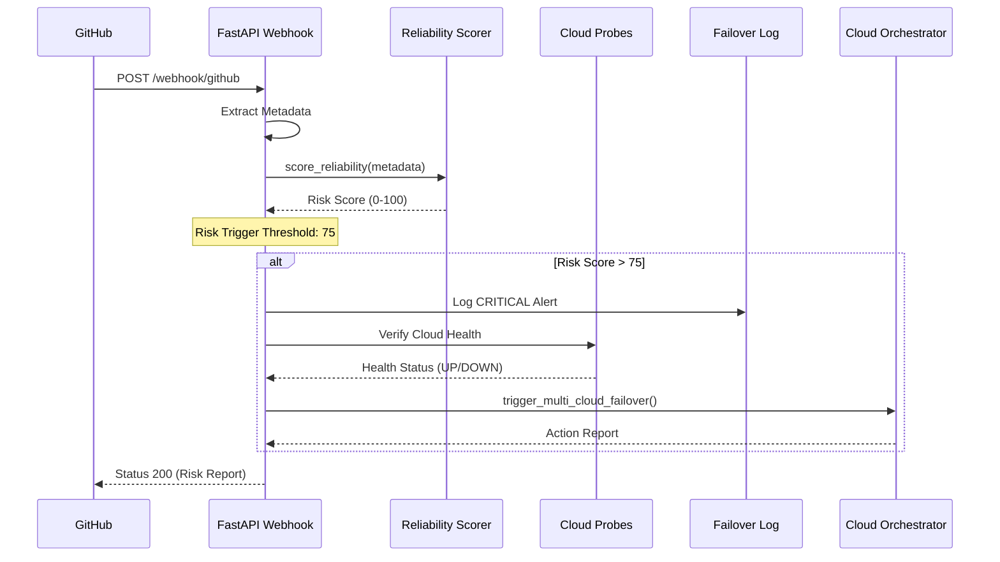

# System Architecture

The **commit-reliability-engine-v2** ensures maximum availability by identifying and mitigating "poison pill" commits before they impact the production environment.

## The Reliability Pipeline

The system operates as a real-time event pipeline:

1.  **Ingestion**: A GitHub Push Webhook triggers the `/webhook/github` endpoint.
2.  **Extraction**: The system parses the commit payload for metadata (files changed, lines, author, and message).
3.  **Risk Scoring**: The `reliability_scorer` evaluates the change. High-risk markers include:
    - Changes to critical paths (`/api`, `/infra`).
    - Keywords like "hotfix" or "urgent" in commit messages.
    - Large volume of file changes (> 20 files).
4.  **Health Verification**: Simultaneously, the engine probes AWS, Azure, and GCP to ensure target failover environments are healthy.
5.  **Proactive Mitigation**: If the risk score is > 75, the engine logs a **CRITICAL** alert and triggers the `CloudOrchestrator` to shift traffic.

## Sequence Diagram

## Modular Design

-   **`api/`**: Modular routers for webhooks, failover management, and cloud probes.
-   **`ml/`**: Heuristic-based scoring engine for instant risk determination.
-   **`cloud_probe/`**: Native SDK integrations for real-time cloud health monitoring.
-   **`orchestrator/`**: Unified control plane for cross-cloud traffic management.

## Inspiration
Inspired by architectural concepts in USPTO Patent Applications **19/344,864** and **19/325,718** by **Venkata Srinivas Kantamneni**.
